# Jotmo 多端同步流程图

> 本文档通过流程图详细说明 Jotmo 多端同步的底层运作方式。所有图表使用 Mermaid 语法，可在 GitHub/GitLab 等平台直接渲染。

---

## 目录

1. [整体架构](#1-整体架构)
2. [三层同步策略](#2-三层同步策略)
3. [Push 流程](#3-push-流程)
4. [Pull 流程](#4-pull-流程)
5. [新设备 vs 旧设备](#5-新设备-vs-旧设备)
6. [增量包（Delta）机制](#6-增量包delta机制)
7. [操作回放（Play/UnPlay）](#7-操作回放playunplay)
8. [冲突检测与解决](#8-冲突检测与解决)
9. [多设备同步时序](#9-多设备同步时序)
10. [数据流转全景图](#10-数据流转全景图)

---

## 1. 整体架构

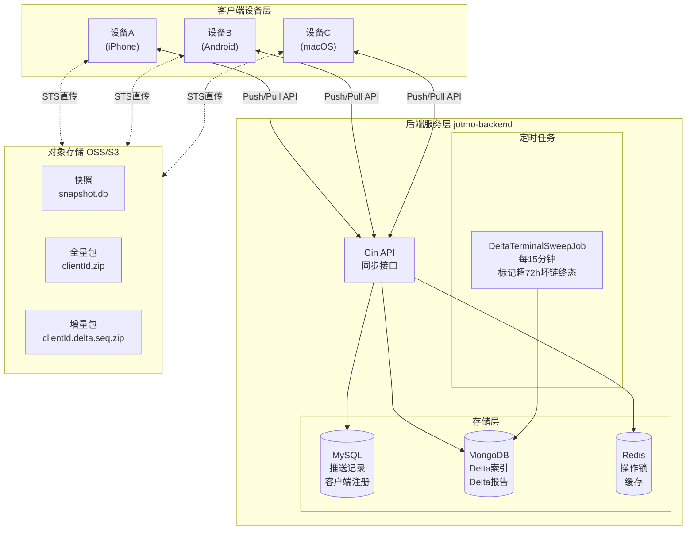
```mermaid
flowchart TB
    subgraph Clients["客户端设备层"]
        A["设备A<br/>(iPhone)"]
        B["设备B<br/>(Android)"]
        C["设备C<br/>(macOS)"]
    end

    subgraph Backend["后端服务层 jotmo-backend"]
        API["Gin API<br/>同步接口"]

        subgraph Storage["存储层"]
            MySQL[("MySQL<br/>推送记录<br/>客户端注册")]
            MongoDB[("MongoDB<br/>Delta索引<br/>Delta报告")]
            Redis[("Redis<br/>操作锁<br/>缓存")]
        end

        subgraph CronJobs["定时任务"]
            Sweep["DeltaTerminalSweepJob<br/>每15分钟<br/>标记超72h坏链终态"]
        end
    end

    subgraph OSS["对象存储 OSS/S3"]
        Snapshot["快照<br/>snapshot.db"]
        FullPack["全量包<br/>clientId.zip"]
        DeltaPack["增量包<br/>clientId.delta.seq.zip"]
    end

    A <-->|"Push/Pull API"| API
    B <-->|"Push/Pull API"| API
    C <-->|"Push/Pull API"| API

    API --> MySQL
    API --> MongoDB
    API --> Redis
    Sweep --> MongoDB

    A <-.->|"STS直传"| OSS
    B <-.->|"STS直传"| OSS
    C <-.->|"STS直传"| OSS
```

**说明**：
- 客户端通过 API 与后端交互获取时间戳、操作锁等
- 实际数据文件（快照、全量包、增量包）通过 STS 凭证直接与 OSS 交互
- 后端使用三种存储：MySQL（推送记录）、MongoDB（Delta 元数据）、Redis（锁和缓存）
- `DeltaTerminalSweepJob` 定时任务清理长期异常的 delta 链

---

## 2. 三层同步策略

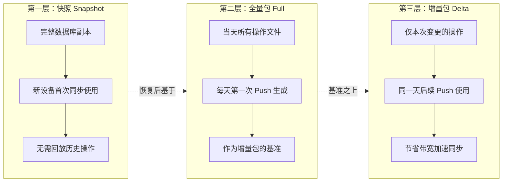
```mermaid
flowchart LR
    subgraph Layer1["第一层：快照 Snapshot"]
        S1["完整数据库副本"]
        S2["新设备首次同步使用"]
        S3["无需回放历史操作"]
        S1 --> S2 --> S3
    end

    subgraph Layer2["第二层：全量包 Full"]
        F1["当天所有操作文件"]
        F2["每天第一次 Push 生成"]
        F3["作为增量包的基准"]
        F1 --> F2 --> F3
    end

    subgraph Layer3["第三层：增量包 Delta"]
        D1["仅本次变更的操作"]
        D2["同一天后续 Push 使用"]
        D3["节省带宽加速同步"]
        D1 --> D2 --> D3
    end

    Layer1 -.->|"恢复后基于"| Layer2
    Layer2 -.->|"基准之上"| Layer3
```

**选择逻辑**：

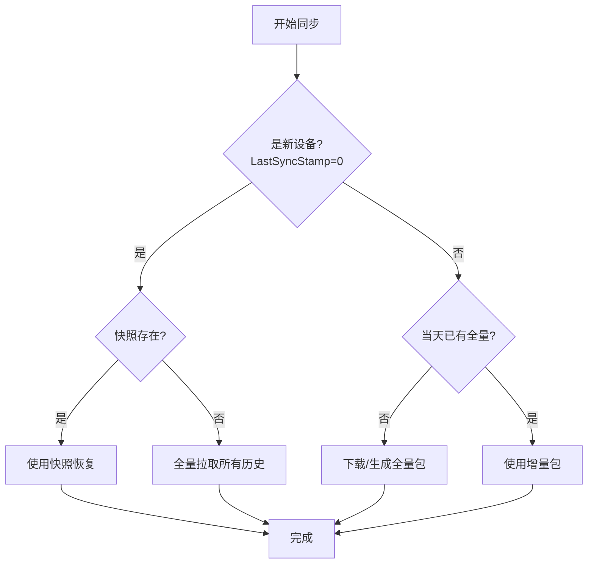
```mermaid
flowchart TD
    Start["开始同步"] --> Q1{"是新设备?<br/>LastSyncStamp=0"}

    Q1 -->|"是"| Q2{"快照存在?"}
    Q2 -->|"是"| UseSnapshot["使用快照恢复"]
    Q2 -->|"否"| UseFull1["全量拉取所有历史"]

    Q1 -->|"否"| Q3{"当天已有全量?"}
    Q3 -->|"否"| UseFull2["下载/生成全量包"]
    Q3 -->|"是"| UseDelta["使用增量包"]

    UseSnapshot --> Done["完成"]
    UseFull1 --> Done
    UseFull2 --> Done
    UseDelta --> Done
```

---

## 3. Push 流程

### 3.1 Push 完整流程

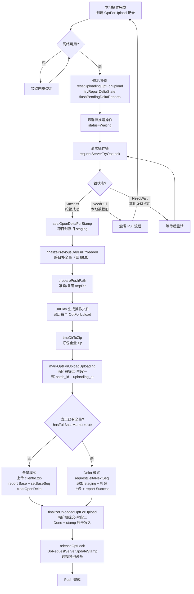
```mermaid
flowchart TD
    Start["本地操作完成<br/>创建 OptForUpload 记录"] --> NetCheck{"网络可用?"}

    NetCheck -->|"否"| Wait["等待网络恢复"]
    Wait --> NetCheck

    NetCheck -->|"是"| Repair["修复/补偿<br/>resetUploadingOptForUpload<br/>tryRepairDeltaState<br/>flushPendingDeltaReports"]

    Repair --> GetOpts["筛选待推送操作<br/>status=Waiting"]
    GetOpts --> TryLock["请求操作锁<br/>requestServerTryOptLock"]

    TryLock --> LockResult{"锁状态?"}

    LockResult -->|"Success<br/>抢锁成功"| Seal["sealOpenDeltaForStamp<br/>跨日封存旧 staging"]
    LockResult -->|"NeedPull<br/>本地数据旧"| DoPull["触发 Pull 流程"]
    LockResult -->|"NeedWait<br/>其他设备占用"| WaitRetry["等待后重试"]

    DoPull --> Start
    WaitRetry --> TryLock

    Seal --> CrossDay["finalizePreviousDayFullIfNeeded<br/>跨日补全量（见 §6.8）"]

    CrossDay --> PrepareDir["preparePushPath<br/>准备/复用 tmpDir"]
    PrepareDir --> UnPlay["UnPlay 生成操作文件<br/>遍历每个 OptForUpload"]

    UnPlay --> PackZip["tmpDirToZip<br/>打包全量 zip"]

    PackZip --> Phase1["markOptForUploadUploading<br/>两阶段提交-阶段一<br/>赋 batch_id + uploading_at"]

    Phase1 --> CheckDelta{"当天已有全量?<br/>hasFullBaseMarker=true"}

    CheckDelta -->|"否"| GenFull["全量模式<br/>上传 clientId.zip<br/>report Base + setBaseSeq<br/>clearOpenDelta"]
    CheckDelta -->|"是"| GenDelta["Delta 模式<br/>requestDeltaNextSeq<br/>追加 staging + 打包<br/>上传 + report Success"]

    GenFull --> Phase2["finalizeUploadedOptForUpload<br/>两阶段提交-阶段二<br/>Done + stamp 原子写入"]
    GenDelta --> Phase2

    Phase2 --> Release["releaseOptLock<br/>DoRequestServerUpdateStamp<br/>通知其他设备"]

    Release --> Done["Push 完成"]
```

### 3.2 操作锁判断逻辑

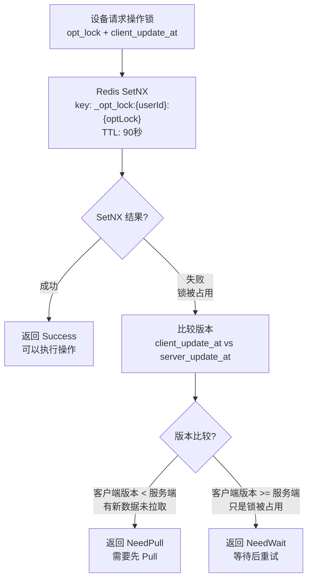
```mermaid
flowchart TD
    Request["设备请求操作锁<br/>opt_lock + client_update_at"] --> RedisSetNX["Redis SetNX<br/>key: _opt_lock:{userId}:{optLock}<br/>TTL: 90秒"]

    RedisSetNX --> SetNXResult{"SetNX 结果?"}

    SetNXResult -->|"成功"| ReturnSuccess["返回 Success<br/>可以执行操作"]

    SetNXResult -->|"失败<br/>锁被占用"| CompareVersion["比较版本<br/>client_update_at vs server_update_at"]

    CompareVersion --> VersionResult{"版本比较?"}

    VersionResult -->|"客户端版本 < 服务端<br/>有新数据未拉取"| ReturnNeedPull["返回 NeedPull<br/>需要先 Pull"]

    VersionResult -->|"客户端版本 >= 服务端<br/>只是锁被占用"| ReturnNeedWait["返回 NeedWait<br/>等待后重试"]
```

### 3.3 同步 Push vs 异步 Push

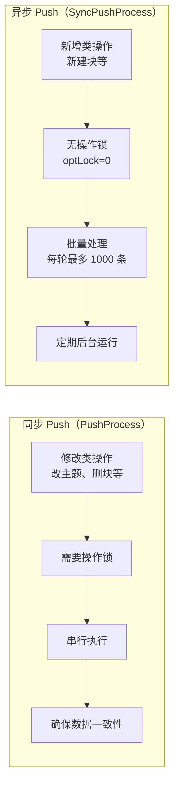
```mermaid
flowchart LR
    subgraph SyncPush["同步 Push（PushProcess）"]
        SP1["修改类操作<br/>改主题、删块等"]
        SP2["需要操作锁"]
        SP3["串行执行"]
        SP4["确保数据一致性"]
        SP1 --> SP2 --> SP3 --> SP4
    end

    subgraph AsyncPush["异步 Push（SyncPushProcess）"]
        AP1["新增类操作<br/>新建块等"]
        AP2["无操作锁<br/>optLock=0"]
        AP3["批量处理<br/>每轮最多 1000 条"]
        AP4["定期后台运行"]
        AP1 --> AP2 --> AP3 --> AP4
    end
```

### 3.4 两阶段提交细节

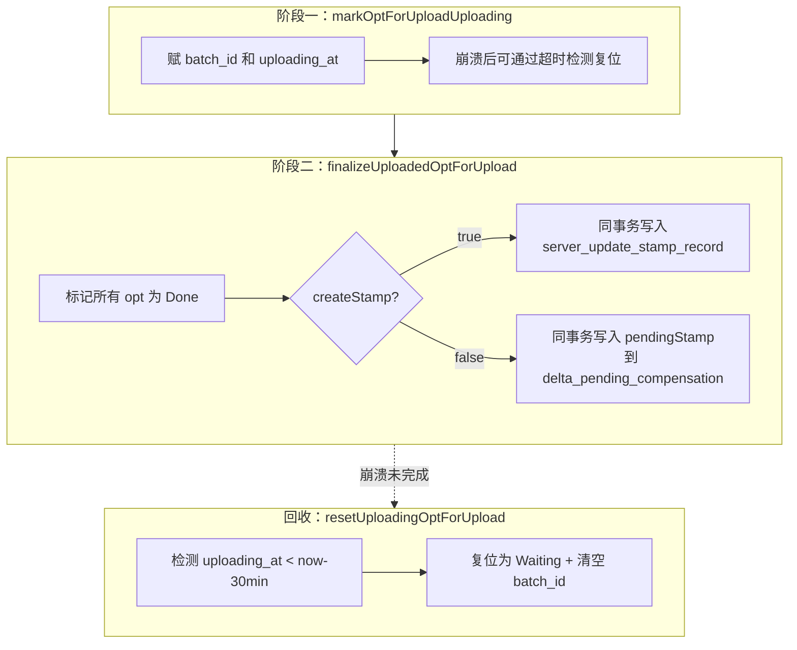
```mermaid
flowchart TD
    subgraph Phase1["阶段一：markOptForUploadUploading"]
        P1A["赋 batch_id 和 uploading_at"]
        P1B["崩溃后可通过超时检测复位"]
        P1A --> P1B
    end

    subgraph Phase2["阶段二：finalizeUploadedOptForUpload"]
        P2A["标记所有 opt 为 Done"]
        P2B{"createStamp?"}
        P2B -->|"true"| P2C["同事务写入<br/>server_update_stamp_record"]
        P2B -->|"false"| P2D["同事务写入 pendingStamp<br/>到 delta_pending_compensation"]
        P2A --> P2B
    end

    subgraph Recovery["回收：resetUploadingOptForUpload"]
        R1["检测 uploading_at < now-30min"]
        R2["复位为 Waiting + 清空 batch_id"]
        R1 --> R2
    end

    Phase1 --> Phase2
    Phase2 -.->|"崩溃未完成"| Recovery
```

**关键**: stamp/pendingStamp 与 Done 状态在同一事务中原子写入，避免"Done 但 stamp 丢失"的半提交状态。

---

## 4. Pull 流程

### 4.1 Pull 完整流程

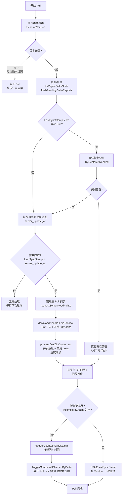
```mermaid
flowchart TD
    Start["开始 Pull"] --> CheckVersion["检查本地版本<br/>SchemaVersion"]

    CheckVersion --> VersionOK{"版本兼容?"}
    VersionOK -->|"否<br/>远端版本过高"| BlockPull["阻止 Pull<br/>提示升级应用"]

    VersionOK -->|"是"| Repair["修复/补偿<br/>tryRepairDeltaState<br/>flushPendingDeltaReports"]

    Repair --> CheckFirst{"LastSyncStamp = 0?<br/>首次 Pull?"}

    CheckFirst -->|"是"| TrySnapshot["尝试恢复快照<br/>TryRestoreIfNeeded"]
    CheckFirst -->|"否"| GetServerTime["获取服务端更新时间<br/>server_update_at"]

    TrySnapshot --> SnapshotExist{"快照存在?"}
    SnapshotExist -->|"是"| RestoreSnapshot["恢复快照流程<br/>（见下方详图）"]
    SnapshotExist -->|"否"| GetServerTime

    GetServerTime --> CompareTime{"需要拉取?<br/>LastSyncStamp < server_update_at"}
    CompareTime -->|"否"| NoChange["无需拉取<br/>等待下次轮询"]

    CompareTime -->|"是"| GetPullList["获取需 Pull 列表<br/>requestServerNeedPullLs"]

    GetPullList --> DownloadZips["downloadNeedPullZipToLocal<br/>并发下载 + 逐链拉取 delta"]

    DownloadZips --> ProcessChains["processOssZipConcurrent<br/>并发解压 + 应用 delta<br/>逐链降级"]

    ProcessChains --> Play["按类型+时间顺序<br/>回放操作"]

    Play --> CheckIncomplete{"所有链完整?<br/>incompleteChains 为空?"}

    CheckIncomplete -->|"是"| UpdateStamp["updateUserLastSyncStamp<br/>推进同步时间"]
    CheckIncomplete -->|"否"| PartialFail["不推进 lastSyncStamp<br/>报 Sentry，下次重试"]

    UpdateStamp --> TriggerSnapshot["TriggerSnapshotIfNeededByDelta<br/>累计 delta >= 1000 时触发快照"]

    RestoreSnapshot --> Play
    TriggerSnapshot --> Done["Pull 完成"]
    PartialFail --> Done
```

### 4.2 逐链 Delta 下载与降级

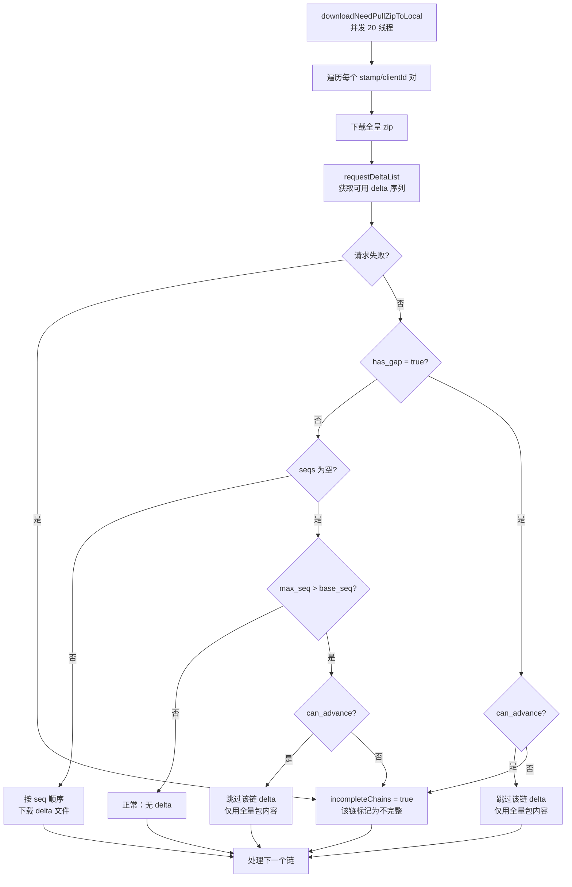
```mermaid
flowchart TD
    Start["downloadNeedPullZipToLocal<br/>并发 20 线程"] --> ForEach["遍历每个 stamp/clientId 对"]

    ForEach --> DownloadZip["下载全量 zip"]

    DownloadZip --> RequestList["requestDeltaList<br/>获取可用 delta 序列"]

    RequestList --> CheckErr{"请求失败?"}
    CheckErr -->|"是"| MarkIncomplete["incompleteChains = true<br/>该链标记为不完整"]

    CheckErr -->|"否"| CheckGap{"has_gap = true?"}

    CheckGap -->|"否"| CheckSeqs{"seqs 为空?"}

    CheckGap -->|"是"| CheckAdvance1{"can_advance?"}
    CheckAdvance1 -->|"是"| SkipDelta1["跳过该链 delta<br/>仅用全量包内容"]
    CheckAdvance1 -->|"否"| MarkIncomplete

    CheckSeqs -->|"否"| DownloadDeltas["按 seq 顺序<br/>下载 delta 文件"]
    CheckSeqs -->|"是"| CheckMaxSeq{"max_seq > base_seq?"}

    CheckMaxSeq -->|"否"| NoDelta["正常：无 delta"]
    CheckMaxSeq -->|"是"| CheckAdvance2{"can_advance?"}
    CheckAdvance2 -->|"是"| SkipDelta2["跳过该链 delta<br/>仅用全量包内容"]
    CheckAdvance2 -->|"否"| MarkIncomplete

    DownloadDeltas --> NextChain["处理下一个链"]
    SkipDelta1 --> NextChain
    SkipDelta2 --> NextChain
    NoDelta --> NextChain
    MarkIncomplete --> NextChain
```

**关键设计**: 逐链降级 — 单个链的 delta 异常不阻塞其他链的处理。`CanAdvance=true` 表示该链已被后端标记为 Terminal，客户端可安全跳过 delta gap。

### 4.3 快照恢复流程

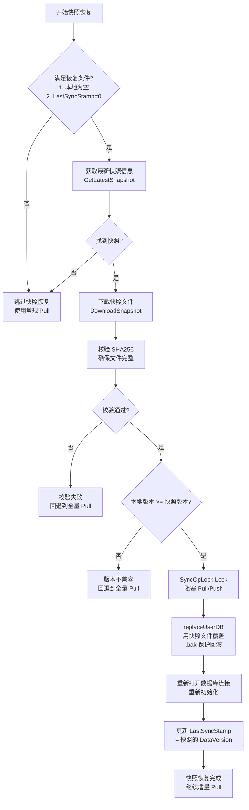
```mermaid
flowchart TD
    Start["开始快照恢复"] --> CheckCondition{"满足恢复条件?<br/>1. 本地为空<br/>2. LastSyncStamp=0"}

    CheckCondition -->|"否"| Skip["跳过快照恢复<br/>使用常规 Pull"]

    CheckCondition -->|"是"| GetLatest["获取最新快照信息<br/>GetLatestSnapshot"]

    GetLatest --> SnapshotFound{"找到快照?"}
    SnapshotFound -->|"否"| Skip

    SnapshotFound -->|"是"| Download["下载快照文件<br/>DownloadSnapshot"]

    Download --> Verify["校验 SHA256<br/>确保文件完整"]

    Verify --> VerifyOK{"校验通过?"}
    VerifyOK -->|"否"| VerifyFail["校验失败<br/>回退到全量 Pull"]

    VerifyOK -->|"是"| CheckSchemaVer{"本地版本 >= 快照版本?"}
    CheckSchemaVer -->|"否"| VersionFail["版本不兼容<br/>回退到全量 Pull"]

    CheckSchemaVer -->|"是"| AcquireLock["SyncOpLock.Lock<br/>阻塞 Pull/Push"]

    AcquireLock --> Replace["replaceUserDB<br/>用快照文件覆盖<br/>.bak 保护回滚"]

    Replace --> ReopenDB["重新打开数据库连接<br/>重新初始化"]

    ReopenDB --> UpdateStamp["更新 LastSyncStamp<br/>= 快照的 DataVersion"]

    UpdateStamp --> Done["快照恢复完成<br/>继续增量 Pull"]
```

---

## 5. 新设备 vs 旧设备

### 5.1 同步路径对比

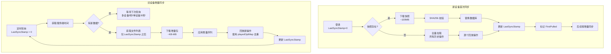
```mermaid
flowchart TB
    subgraph NewDevice["新设备首次同步"]
        N1["登录<br/>LastSyncStamp=0"] --> N2{"快照存在?"}
        N2 -->|"是"| N3["下载快照<br/>~100MB"]
        N2 -->|"否"| N4["全量拉取<br/>所有历史操作"]
        N3 --> N5["SHA256 校验"]
        N5 --> N6["替换数据库"]
        N6 --> N7["更新 LastSyncStamp"]
        N4 --> N8["逐个回放操作"]
        N8 --> N7
        N7 --> N9["标记 FirstPulled"]
        N9 --> N10["后续按增量同步"]
    end

    subgraph OldDevice["旧设备增量同步"]
        O1["定时轮询<br/>LastSyncStamp > 0"] --> O2["获取服务端时间"]
        O2 --> O3{"有新数据?"}
        O3 -->|"否"| O4["等待下次轮询<br/>多设备5秒/单设备30秒"]
        O3 -->|"是"| O5["获取文件列表<br/>仅 LastSyncStamp 之后"]
        O5 --> O6["下载增量包<br/>~KB-MB"]
        O6 --> O7["应用增量序列"]
        O7 --> O8["回放新操作<br/>使用 playedOptMap 去重"]
        O8 --> O9["更新 LastSyncStamp"]
        O9 --> O1
    end
```

### 5.2 数据量对比

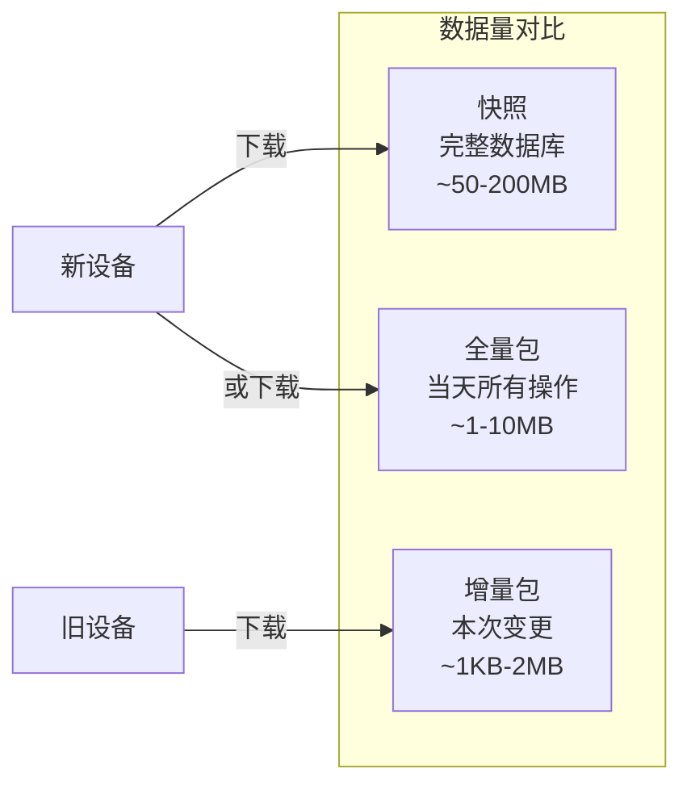
```mermaid
flowchart LR
    subgraph DataSize["数据量对比"]
        direction TB
        Snapshot["快照<br/>完整数据库<br/>~50-200MB"]
        FullPack["全量包<br/>当天所有操作<br/>~1-10MB"]
        DeltaPack["增量包<br/>本次变更<br/>~1KB-2MB"]
    end

    NewDev["新设备"] -->|"下载"| Snapshot
    NewDev -->|"或下载"| FullPack

    OldDev["旧设备"] -->|"下载"| DeltaPack
```

---

## 6. 增量包（Delta）机制

### 6.1 增量包结构

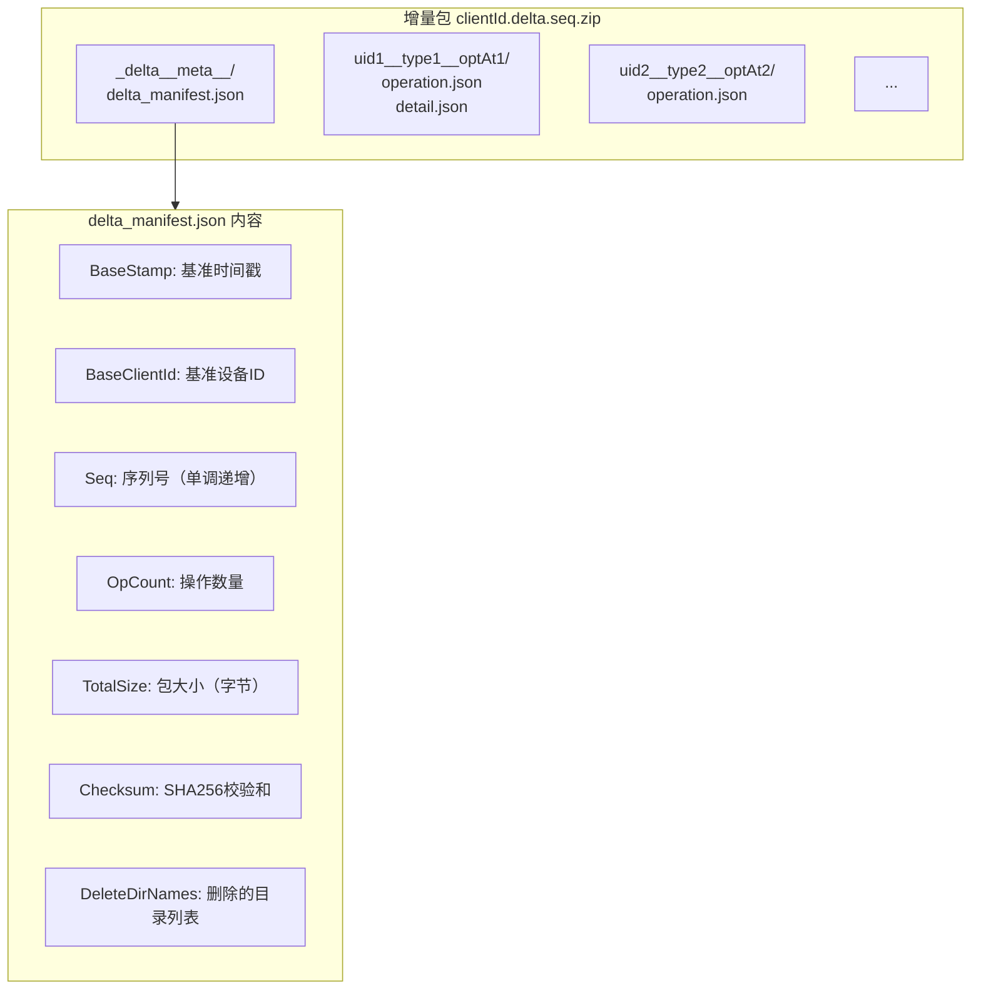
```mermaid
flowchart TB
    subgraph DeltaZip["增量包 clientId.delta.seq.zip"]
        Meta["_delta__meta__/<br/>delta_manifest.json"]
        Op1["uid1__type1__optAt1/<br/>operation.json<br/>detail.json"]
        Op2["uid2__type2__optAt2/<br/>operation.json"]
        Op3["..."]
    end

    subgraph Manifest["delta_manifest.json 内容"]
        M1["BaseStamp: 基准时间戳"]
        M2["BaseClientId: 基准设备ID"]
        M3["Seq: 序列号（单调递增）"]
        M4["OpCount: 操作数量"]
        M5["TotalSize: 包大小（字节）"]
        M6["Checksum: SHA256校验和"]
        M7["DeleteDirNames: 删除的目录列表"]
    end

    Meta --> Manifest
```

### 6.2 客户端增量包状态机

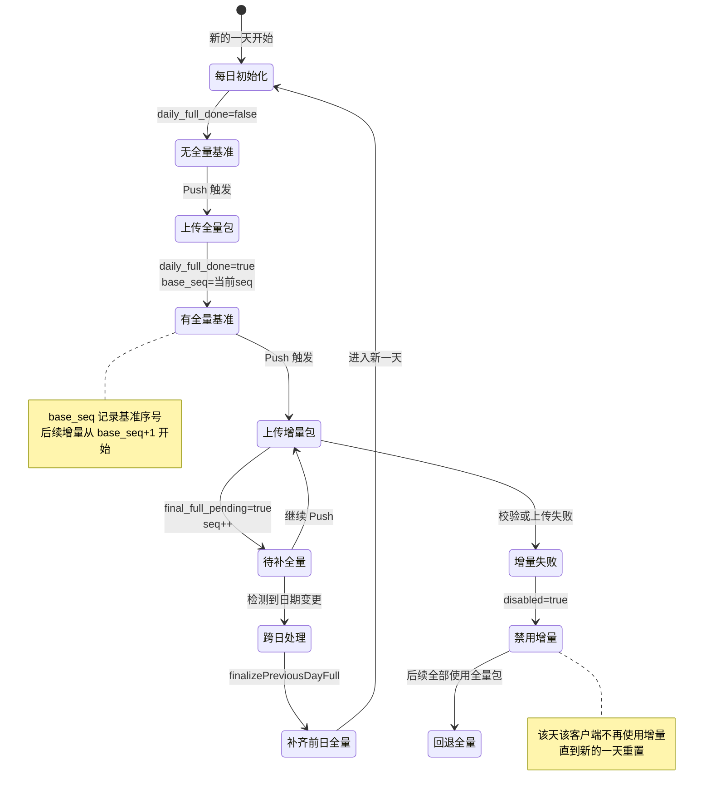
```mermaid
stateDiagram-v2
    [*] --> 每日初始化: 新的一天开始

    每日初始化 --> 无全量基准: daily_full_done=false

    无全量基准 --> 上传全量包: Push 触发

    上传全量包 --> 有全量基准: daily_full_done=true<br/>base_seq=当前seq

    有全量基准 --> 上传增量包: Push 触发

    上传增量包 --> 待补全量: final_full_pending=true<br/>seq++

    待补全量 --> 上传增量包: 继续 Push

    待补全量 --> 跨日处理: 检测到日期变更

    跨日处理 --> 补齐前日全量: finalizePreviousDayFull

    补齐前日全量 --> 每日初始化: 进入新一天

    上传增量包 --> 增量失败: 校验或上传失败

    增量失败 --> 禁用增量: disabled=true

    禁用增量 --> 回退全量: 后续全部使用全量包

    note right of 有全量基准
        base_seq 记录基准序号
        后续增量从 base_seq+1 开始
    end note

    note right of 禁用增量
        该天该客户端不再使用增量
        直到新的一天重置
    end note
```

### 6.3 增量包生成流程

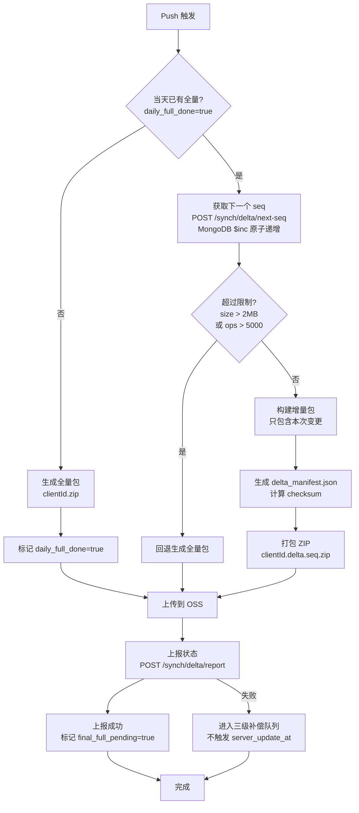
```mermaid
flowchart TD
    Start["Push 触发"] --> CheckFull{"当天已有全量?<br/>daily_full_done=true"}

    CheckFull -->|"否"| GenFull["生成全量包<br/>clientId.zip"]
    GenFull --> MarkFull["标记 daily_full_done=true"]
    MarkFull --> Upload

    CheckFull -->|"是"| GetSeq["获取下一个 seq<br/>POST /synch/delta/next-seq<br/>MongoDB $inc 原子递增"]

    GetSeq --> CheckLimit{"超过限制?<br/>size > 2MB<br/>或 ops > 5000"}

    CheckLimit -->|"是"| FallbackFull["回退生成全量包"]
    FallbackFull --> Upload

    CheckLimit -->|"否"| BuildDelta["构建增量包<br/>只包含本次变更"]

    BuildDelta --> GenManifest["生成 delta_manifest.json<br/>计算 checksum"]

    GenManifest --> PackZip["打包 ZIP<br/>clientId.delta.seq.zip"]

    PackZip --> Upload["上传到 OSS"]

    Upload --> Report["上报状态<br/>POST /synch/delta/report"]

    Report --> MarkPending["上报成功<br/>标记 final_full_pending=true"]
    Report -->|"失败"| PendingQueue["进入三级补偿队列<br/>不触发 server_update_at"]

    MarkPending --> Done["完成"]
    PendingQueue --> Done
```

### 6.4 增量包应用流程

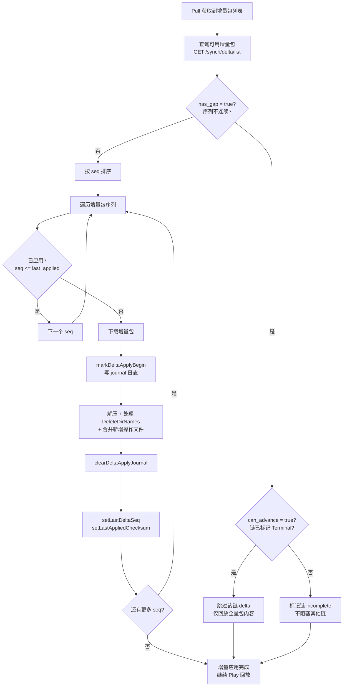
```mermaid
flowchart TD
    Start["Pull 获取到增量包列表"] --> FetchList["查询可用增量包<br/>GET /synch/delta/list"]

    FetchList --> CheckGap{"has_gap = true?<br/>序列不连续?"}

    CheckGap -->|"是"| CheckAdvance{"can_advance = true?<br/>链已标记 Terminal?"}

    CheckAdvance -->|"是"| SkipDelta["跳过该链 delta<br/>仅回放全量包内容"]
    CheckAdvance -->|"否"| MarkIncomplete["标记链 incomplete<br/>不阻塞其他链"]

    CheckGap -->|"否"| SortSeqs["按 seq 排序"]

    SortSeqs --> Loop["遍历增量包序列"]

    Loop --> CheckApplied{"已应用?<br/>seq <= last_applied"}

    CheckApplied -->|"是"| NextSeq["下一个 seq"]
    NextSeq --> Loop

    CheckApplied -->|"否"| Download["下载增量包"]

    Download --> WriteJournal["markDeltaApplyBegin<br/>写 journal 日志"]

    WriteJournal --> Apply["解压 + 处理 DeleteDirNames<br/>+ 合并新增操作文件"]

    Apply --> ClearJournal["clearDeltaApplyJournal"]

    ClearJournal --> UpdateApplied["setLastDeltaSeq<br/>setLastAppliedChecksum"]

    UpdateApplied --> MoreSeqs{"还有更多 seq?"}

    MoreSeqs -->|"是"| Loop
    MoreSeqs -->|"否"| Done["增量应用完成<br/>继续 Play 回放"]
    SkipDelta --> Done
    MarkIncomplete --> Done
```

### 6.5 后端连续性检查

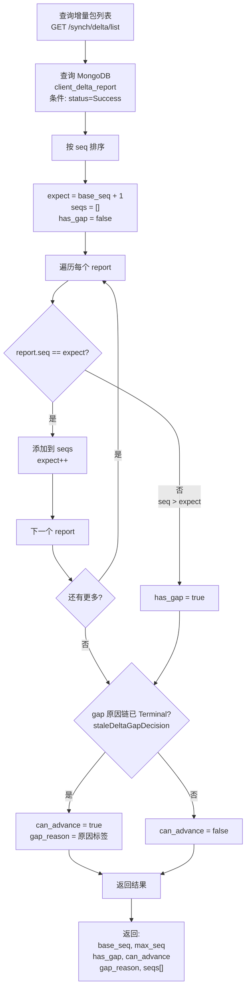
```mermaid
flowchart TD
    Start["查询增量包列表<br/>GET /synch/delta/list"] --> Query["查询 MongoDB<br/>client_delta_report<br/>条件: status=Success"]

    Query --> Sort["按 seq 排序"]

    Sort --> Init["expect = base_seq + 1<br/>seqs = []<br/>has_gap = false"]

    Init --> Loop["遍历每个 report"]

    Loop --> Check{"report.seq == expect?"}

    Check -->|"是"| Add["添加到 seqs<br/>expect++"]
    Add --> Next["下一个 report"]
    Next --> HasMore{"还有更多?"}
    HasMore -->|"是"| Loop
    HasMore -->|"否"| CheckTerminal

    Check -->|"否<br/>seq > expect"| SetGap["has_gap = true"]
    SetGap --> CheckTerminal{"gap 原因链已 Terminal?<br/>staleDeltaGapDecision"}

    CheckTerminal -->|"是"| SetAdvance["can_advance = true<br/>gap_reason = 原因标签"]
    CheckTerminal -->|"否"| NoAdvance["can_advance = false"]

    SetAdvance --> Return["返回结果"]
    NoAdvance --> Return

    Return --> Result["返回:<br/>base_seq, max_seq<br/>has_gap, can_advance<br/>gap_reason, seqs[]"]
```

### 6.6 后端 Delta 链状态机

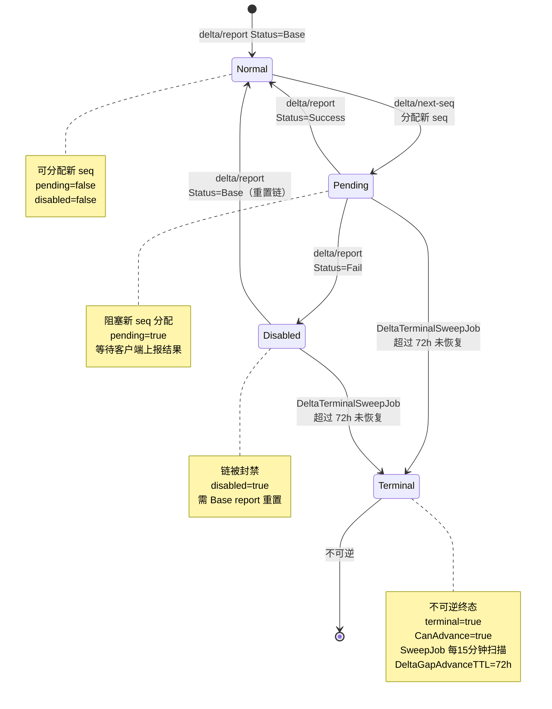
```mermaid
stateDiagram-v2
    [*] --> Normal: delta/report Status=Base

    Normal --> Pending: delta/next-seq<br/>分配新 seq

    Pending --> Normal: delta/report<br/>Status=Success

    Pending --> Disabled: delta/report<br/>Status=Fail

    Pending --> Terminal: DeltaTerminalSweepJob<br/>超过 72h 未恢复

    Disabled --> Normal: delta/report<br/>Status=Base（重置链）

    Disabled --> Terminal: DeltaTerminalSweepJob<br/>超过 72h 未恢复

    Terminal --> [*]: 不可逆

    note right of Normal
        可分配新 seq
        pending=false
        disabled=false
    end note

    note right of Pending
        阻塞新 seq 分配
        pending=true
        等待客户端上报结果
    end note

    note right of Disabled
        链被封禁
        disabled=true
        需 Base report 重置
    end note

    note right of Terminal
        不可逆终态
        terminal=true
        CanAdvance=true
        SweepJob 每15分钟扫描
        DeltaGapAdvanceTTL=72h
    end note
```

**状态转换触发者**:
- `Normal → Pending`: 客户端调用 `delta/next-seq`
- `Pending → Normal`: 客户端调用 `delta/report(Success)`
- `Pending → Disabled`: 客户端调用 `delta/report(Fail)` 或 seq mismatch
- `Disabled → Normal`: 客户端调用 `delta/report(Base)` 重新上传全量
- `→ Terminal`: 后端 `DeltaTerminalSweepJob` 每 15 分钟批量扫描（batch=500），标记超过 72h 的 Pending/Disabled 链
- `staleDeltaGapDecision` 为**纯函数**（无读路径副作用），仅检查 Terminal 标志

### 6.7 三级补偿队列架构

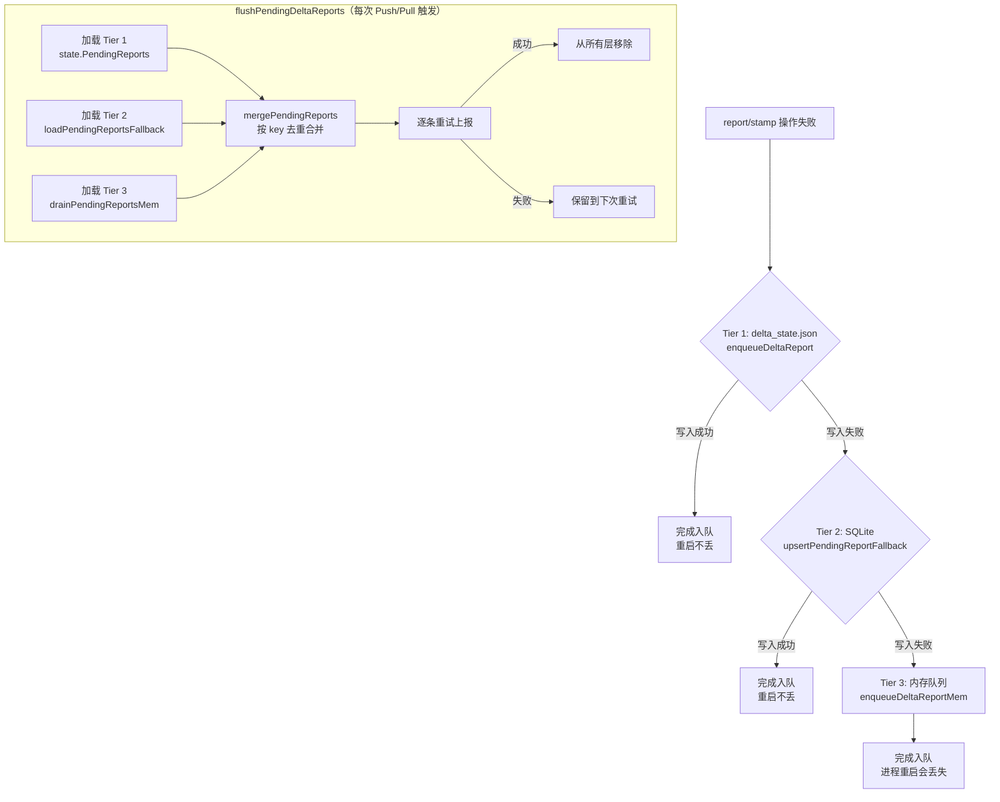
```mermaid
flowchart TD
    Trigger["report/stamp 操作失败"] --> T1{"Tier 1: delta_state.json<br/>enqueueDeltaReport"}

    T1 -->|"写入成功"| Done1["完成入队<br/>重启不丢"]
    T1 -->|"写入失败"| T2{"Tier 2: SQLite<br/>upsertPendingReportFallback"}

    T2 -->|"写入成功"| Done2["完成入队<br/>重启不丢"]
    T2 -->|"写入失败"| T3["Tier 3: 内存队列<br/>enqueueDeltaReportMem"]

    T3 --> Done3["完成入队<br/>进程重启会丢失"]

    subgraph Flush["flushPendingDeltaReports（每次 Push/Pull 触发）"]
        Load1["加载 Tier 1<br/>state.PendingReports"]
        Load2["加载 Tier 2<br/>loadPendingReportsFallback"]
        Load3["加载 Tier 3<br/>drainPendingReportsMem"]
        Load1 --> Merge
        Load2 --> Merge
        Load3 --> Merge
        Merge["mergePendingReports<br/>按 key 去重合并"]
        Merge --> Retry["逐条重试上报"]
        Retry -->|"成功"| Remove["从所有层移除"]
        Retry -->|"失败"| Keep["保留到下次重试"]
    end
```

### 6.8 跨日补全量状态机

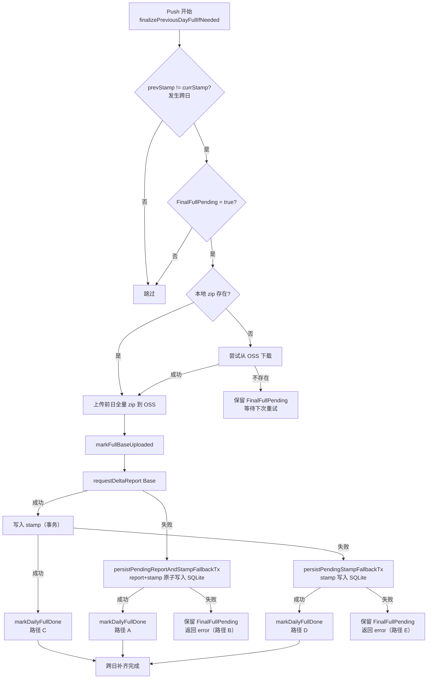
```mermaid
flowchart TD
    Start["Push 开始<br/>finalizePreviousDayFullIfNeeded"] --> CheckCross{"prevStamp != currStamp?<br/>发生跨日"}

    CheckCross -->|"否"| Skip["跳过"]
    CheckCross -->|"是"| CheckPending{"FinalFullPending = true?"}

    CheckPending -->|"否"| Skip
    CheckPending -->|"是"| CheckZip{"本地 zip 存在?"}

    CheckZip -->|"否"| TryRemote["尝试从 OSS 下载"]
    CheckZip -->|"是"| Upload["上传前日全量 zip 到 OSS"]

    TryRemote -->|"成功"| Upload
    TryRemote -->|"不存在"| KeepPending1["保留 FinalFullPending<br/>等待下次重试"]

    Upload --> MarkBase["markFullBaseUploaded"]
    MarkBase --> Report["requestDeltaReport Base"]

    Report -->|"成功"| WriteStamp["写入 stamp（事务）"]
    Report -->|"失败"| PersistBoth["persistPendingReportAndStampFallbackTx<br/>report+stamp 原子写入 SQLite"]

    WriteStamp -->|"成功"| MarkDoneC["markDailyFullDone<br/>路径 C"]
    WriteStamp -->|"失败"| PersistStamp["persistPendingStampFallbackTx<br/>stamp 写入 SQLite"]

    PersistBoth -->|"成功"| MarkDoneA["markDailyFullDone<br/>路径 A"]
    PersistBoth -->|"失败"| KeepPending2["保留 FinalFullPending<br/>返回 error（路径 B）"]

    PersistStamp -->|"成功"| MarkDoneD["markDailyFullDone<br/>路径 D"]
    PersistStamp -->|"失败"| KeepPending3["保留 FinalFullPending<br/>返回 error（路径 E）"]

    MarkDoneC --> Done["跨日补齐完成"]
    MarkDoneA --> Done
    MarkDoneD --> Done
```

**不变式**: `markDailyFullDone`（清除 `FinalFullPending`）**仅在补偿数据确认持久化后才调用**。五条退出路径（A-E）全部遵守此规则。持久化失败时保留 `FinalFullPending`，下次 Push 会重新触发补全量。

---

## 7. 操作回放（Play/UnPlay）

### 7.1 回放顺序

```mermaid
flowchart LR
    subgraph Order["回放顺序（按依赖关系）"]
        O1["1. RMBindObj<br/>远端对象绑定"]
        O2["2. RMSubject<br/>共享主题"]
        O3["3. Subject<br/>本地主题"]
        O4["4. MulSubjectRel<br/>多级主题关联"]
        O5["5. Record<br/>块（批处理）"]
        O6["6. RecordEdit<br/>块编辑"]
        O7["7. ContainerRelation<br/>容器关联"]
        O8["8-N. 其他<br/>配置、历史等"]

        O1 --> O2 --> O3 --> O4 --> O5 --> O6 --> O7 --> O8
    end
```

**顺序设计原理**：
- 共享对象绑定最先（其他对象可能依赖它）
- 主题在块之前（块需要归属到主题）
- 关联关系在最后（被关联的对象必须已存在）

### 7.2 UnPlay 流程（生成操作文件）

```mermaid
flowchart TD
    Start["业务操作发生<br/>如：新增一条笔记"] --> CreateOFU["创建 OptForUpload 记录<br/>type: 操作类型<br/>fk_uid: 对象UID<br/>status: Waiting<br/>opt_at: 操作时间戳"]

    CreateOFU --> WaitPush["等待 Push 触发"]

    WaitPush --> IterateOFU["遍历所有待上传操作"]

    IterateOFU --> GetHandler["根据操作类型<br/>获取对应 Handler"]

    GetHandler --> CallUnPlay["调用 Handler.UnPlay()"]

    CallUnPlay --> QueryDB["从本地数据库查询完整数据<br/>- RecordV2 块基础信息<br/>- RecordDetailV2 块扩展<br/>- RecordFile 文件列表<br/>- RecordBehavior 行为<br/>- RecordLocation 位置<br/>- RecordHashTag 标签"]

    QueryDB --> BuildDetail["构建 detailJson 对象<br/>包含所有关联信息"]

    BuildDetail --> WriteFiles["写入文件<br/>uid__type__optAt/"]

    WriteFiles --> OpJson["operation.json<br/>操作元数据"]
    WriteFiles --> DetailJson["detail.json<br/>完整业务数据"]

    OpJson --> CreateOFD["创建 OptForDownload<br/>用于 Pull 时去重"]
    DetailJson --> CreateOFD

    CreateOFD --> Next["处理下一个 OptForUpload"]
```

### 7.3 Play 流程（回放操作文件）

```mermaid
flowchart TD
    Start["Pull 下载完成<br/>开始回放"] --> BuildMap["构建 playedOptMap<br/>key: uid_optType_optAt"]

    BuildMap --> CheckFirst{"首次 Pull?"}

    CheckFirst -->|"是"| EmptyMap["playedOptMap 为空<br/>所有操作都会执行"]
    CheckFirst -->|"否"| QueryOFD["查询 opt_for_download 表<br/>获取已处理操作"]

    EmptyMap --> IterateOps["按业务类型顺序<br/>遍历操作文件"]
    QueryOFD --> IterateOps

    IterateOps --> ReadOp["读取 operation.json"]

    ReadOp --> CheckPlayed{"playedOptMap<br/>包含该操作?"}

    CheckPlayed -->|"是"| Skip["跳过<br/>避免重复执行"]

    CheckPlayed -->|"否"| LoadDetail["加载 detail.json"]

    LoadDetail --> GetHandler["获取对应 Handler"]

    GetHandler --> CallPlay["调用 Handler.Play()"]

    CallPlay --> ApplyDB["应用到本地数据库<br/>- INSERT/UPDATE/DELETE<br/>- 处理关联关系<br/>- 处理唯一键冲突"]

    ApplyDB --> HandleError{"执行成功?"}

    HandleError -->|"否<br/>唯一键冲突"| Silent["静默处理<br/>（幂等操作）"]
    HandleError -->|"否<br/>其他错误"| Report["上报错误"]
    HandleError -->|"是"| MarkDone["记录 OptForDownload<br/>status=Done"]

    Silent --> MarkDone
    Report --> MarkDone

    MarkDone --> Next["下一个操作"]
    Skip --> Next

    Next --> HasMore{"还有更多操作?"}
    HasMore -->|"是"| IterateOps
    HasMore -->|"否"| Done["回放完成"]
```

### 7.4 操作文件结构

```mermaid
flowchart TB
    subgraph OpFolder["操作文件夹 uid__type__optAt/"]
        OpJson["operation.json"]
        DetailJson["detail.json"]
        Memo["memo.txt（可选）"]
    end

    subgraph OpContent["operation.json 内容"]
        OC1["optType: 操作类型枚举值"]
        OC2["fkUid: 操作对象唯一标识"]
        OC3["optAt: 操作时间戳（毫秒）"]
        OC4["clientId: 发起设备ID"]
        OC5["version: 文件结构版本"]
    end

    subgraph DetailContent["detail.json 内容（以块为例）"]
        DC1["record: 块基础信息"]
        DC2["detail: 块扩展信息"]
        DC3["files: 文件列表"]
        DC4["behaviors: 行为数据"]
        DC5["locations: 位置数据"]
        DC6["hashTags: 标签数据"]
    end

    OpJson --> OpContent
    DetailJson --> DetailContent
```

---

## 8. 冲突检测与解决

### 8.1 操作锁类型

```mermaid
flowchart TB
    subgraph LockTypes["四种操作锁"]
        L1["Record 锁<br/>保护：修改、删除块"]
        L2["ContainerRelation 锁<br/>保护：移动块、修改层级"]
        L3["Subject 锁<br/>保护：修改、删除主题"]
        L4["Top 锁<br/>保护：置顶操作"]
    end

    subgraph LockImpl["锁实现"]
        Redis["Redis SetNX<br/>key: _opt_lock:{userId}:{lockType}<br/>TTL: 90秒"]
    end

    L1 --> Redis
    L2 --> Redis
    L3 --> Redis
    L4 --> Redis
```

### 8.2 写-写冲突场景

```mermaid
sequenceDiagram
    participant A as 设备A
    participant S as 服务端
    participant B as 设备B

    Note over A,B: 场景：A 和 B 同时想修改同一个块

    A->>S: 请求操作锁
    S-->>A: Success（获得锁）

    B->>S: 请求操作锁
    S-->>B: NeedPull（锁被占用，且 B 版本旧）

    A->>A: 执行本地修改
    A->>S: 上传修改，释放锁
    S->>S: 更新时间戳 pushAt_1

    B->>S: Pull 请求
    S-->>B: 返回 A 的修改
    B->>B: 应用 A 的修改

    B->>S: 再次请求操作锁
    S-->>B: Success（获得锁）

    B->>B: 基于 A 的版本执行修改
    B->>S: 上传修改，释放锁
    S->>S: 更新时间戳 pushAt_2

    Note over A,B: 结果：B 的修改覆盖 A（基于 A 的版本）
```

### 8.3 去重机制

```mermaid
flowchart TD
    subgraph Dedup["去重机制"]
        Key["playedOptMap 的 key 格式<br/>{对象UID}_{操作类型}_{操作时间戳}"]

        First["首次 Pull"]
        First --> FirstResult["playedOptMap 为空<br/>所有操作都执行"]

        Incr["增量 Pull"]
        Incr --> QueryOFD["查询 opt_for_download 表"]
        QueryOFD --> BuildMap["构建 playedOptMap"]
        BuildMap --> IncrResult["已存在的操作跳过"]
    end
```

### 8.4 冲突解决策略

```mermaid
flowchart LR
    subgraph Strategy["最后写入胜出 Last Write Wins"]
        S1["所有操作按<br/>全局时间戳排序"]
        S2["后推送的操作<br/>覆盖先推送的"]
        S3["业务层面冲突<br/>需用户手动合并"]
        S1 --> S2 --> S3
    end
```

---

## 9. 多设备同步时序

### 9.1 完整同步时序图

```mermaid
sequenceDiagram
    participant A as 设备A（旧设备）
    participant API as 后端 API
    participant OSS as OSS 存储
    participant B as 设备B（新设备）

    Note over A,B: === 场景1：设备A推送数据 ===

    A->>API: GET /synch/get/push-at
    API-->>A: pushAt=1704067200

    A->>API: POST /synch/try-opt-lock
    API-->>A: Success

    A->>A: UnPlay 生成操作文件
    A->>A: 打包 ZIP

    A->>OSS: 上传全量包

    A->>API: POST /synch/delta/report (Base)
    API-->>A: OK

    A->>API: POST /synch/release-opt-lock
    API->>API: 创建 ClientPushRecord
    API-->>A: OK

    Note over A,B: === 场景2：新设备B首次同步 ===

    B->>API: Pull 请求 (LastSyncStamp=0)
    API-->>B: 返回快照信息

    B->>OSS: 下载快照 snapshot.db
    B->>B: SHA256 校验
    B->>B: 替换本地数据库
    B->>B: 更新 LastSyncStamp

    Note over A,B: === 场景3：设备A推送增量 ===

    A->>API: POST /synch/delta/next-seq
    API-->>A: seq=1 (pending=true)

    A->>A: 生成增量包
    A->>OSS: 上传 clientA.delta.1.zip

    A->>API: POST /synch/delta/report (Success)
    API-->>A: OK (pending=false)

    Note over A,B: === 场景4：设备B增量同步 ===

    B->>API: GET /synch/get/server-update-stamp
    API-->>B: 有新数据

    B->>API: GET /synch/get/need-pull-info
    API-->>B: 返回文件列表

    B->>API: GET /synch/delta/list
    API-->>B: seqs=[1], has_gap=false

    B->>OSS: 下载增量包
    B->>B: 应用增量包序列
    B->>B: 执行 Play 回放
    B->>B: 更新 LastSyncStamp
```

### 9.2 轮询间隔策略

```mermaid
flowchart TD
    Start["定时轮询触发"] --> CheckOnline["检查在线设备数<br/>Redis 缓存 TTL=120s"]

    CheckOnline --> Multi{"多设备在线?"}

    Multi -->|"是"| Short["5秒轮询<br/>近实时同步"]
    Multi -->|"否"| Long["30秒轮询<br/>省电模式"]

    Short --> Poll["执行 Pull"]
    Long --> Poll

    Poll --> Wait["等待下次轮询"]
    Wait --> Start
```

---

## 10. 数据流转全景图

### 10.1 Push 数据流

```mermaid
flowchart LR
    subgraph Client["客户端"]
        BizOp["业务操作"] --> OFU["opt_for_upload<br/>待上传操作表"]
        OFU --> UnPlay["UnPlay<br/>生成操作文件"]
        UnPlay --> TempDir["push_temp/<br/>临时目录"]
        TempDir --> Zip["打包 ZIP"]
    end

    subgraph Backend["后端"]
        Lock["Redis<br/>操作锁"]
        PushAt["获取<br/>PushAt"]
        Record["MySQL<br/>ClientPushRecord"]
        Delta["MongoDB<br/>Delta 报告"]
    end

    subgraph Storage["存储"]
        Full["全量包<br/>clientId.zip"]
        DeltaPack["增量包<br/>clientId.delta.seq.zip"]
    end

    BizOp -.->|"1.请求锁"| Lock
    Lock -.->|"2.获取时间戳"| PushAt
    Zip -->|"3.上传"| Full
    Zip -->|"3.上传"| DeltaPack
    Full -.->|"4.更新记录"| Record
    DeltaPack -.->|"4.上报状态"| Delta
```

### 10.2 Pull 数据流

```mermaid
flowchart RL
    subgraph Storage["存储"]
        Snapshot["快照<br/>snapshot.db"]
        Full["全量包<br/>clientId.zip"]
        DeltaPack["增量包<br/>clientId.delta.seq.zip"]
    end

    subgraph Backend["后端"]
        ServerTime["服务端<br/>更新时间"]
        PullList["需 Pull<br/>文件列表"]
        DeltaList["Delta<br/>列表查询"]
    end

    subgraph Client["客户端"]
        Cache["download/<br/>缓存目录"]
        Apply["应用增量包<br/>合并操作文件"]
        Play["Play<br/>回放操作"]
        BizDB["业务数据库"]
        OFD["opt_for_download<br/>已处理操作表"]
        SyncStamp["LastSyncStamp"]
    end

    ServerTime -->|"1.查询"| PullList
    PullList -->|"2.获取"| DeltaList

    Snapshot -->|"3a.新设备"| Cache
    Full -->|"3b.全量"| Cache
    DeltaPack -->|"3c.增量"| Cache

    Cache --> Apply
    Apply --> Play
    Play --> BizDB
    Play --> OFD
    OFD --> SyncStamp
```

### 10.3 完整数据流全景

```mermaid
flowchart TB
    subgraph UserAction["用户操作"]
        Action["新增/修改/删除<br/>笔记、主题等"]
    end

    subgraph ClientDB["客户端 SQLite"]
        BizTables["业务表<br/>record/subject 等"]
        OFU["opt_for_upload<br/>待上传"]
        OFD["opt_for_download<br/>已处理"]
        Users["users<br/>LastSyncStamp"]
        Compensation["delta_pending_compensation<br/>补偿队列"]
    end

    subgraph LocalFiles["本地文件"]
        TempDir["push_temp/<br/>临时操作文件"]
        CacheDir["download/<br/>下载缓存"]
        DeltaState["delta_state.json<br/>增量状态"]
    end

    subgraph Backend["后端服务"]
        API["Gin API"]
        MySQL["MySQL<br/>推送记录"]
        MongoDB["MongoDB<br/>Delta 索引"]
        Redis["Redis<br/>锁/缓存"]
        SweepJob["DeltaTerminalSweepJob<br/>每15分钟"]
    end

    subgraph OSS["对象存储"]
        Snapshot["快照"]
        FullPack["全量包"]
        DeltaPack["增量包"]
    end

    subgraph OtherDevice["其他设备"]
        OtherClient["设备B/C/..."]
    end

    %% Push 流程
    Action -->|"1.写入"| BizTables
    Action -->|"2.记录"| OFU
    OFU -->|"3.UnPlay"| TempDir
    TempDir -->|"4.打包上传"| FullPack
    TempDir -->|"4.打包上传"| DeltaPack
    API -->|"5.记录"| MySQL
    API -->|"5.记录"| MongoDB
    OFU -->|"6.更新状态"| OFU

    %% Pull 流程
    OtherClient -->|"Push"| OSS
    OSS -->|"7.下载"| CacheDir
    CacheDir -->|"8.回放"| BizTables
    CacheDir -->|"9.记录"| OFD
    OFD -->|"10.更新"| Users

    %% 补偿流程
    DeltaState <-.->|"三级兜底"| Compensation

    %% 快照恢复
    Snapshot -.->|"首次同步"| BizTables

    %% 终态清理
    SweepJob -.->|"标记Terminal"| MongoDB
```

---

## 附录：关键代码位置

| 功能 | jotmo-mobile | jotmo-backend |
|------|--------------|---------------|
| Push 主流程 | `files/push.go` | `gin/api/synch.go` |
| Pull 主流程 | `files/pull.go` | `gin/compound/synch.go` |
| 操作回放 | `files/play.go` | - |
| 操作生成 | `files/unplay.go` | - |
| 快照创建 | `internal/snapshots/create.go` | - |
| 快照恢复 | `internal/snapshots/restore.go` | - |
| 快照触发 | `internal/snapshots/trigger.go` | - |
| Delta 打包 | `files/delta_upload.go` | - |
| Delta 应用 | `files/delta_apply.go` | - |
| Delta 状态 | `files/delta_state.go` | - |
| Delta 数据模型 | `files/delta_models.go` | - |
| Delta API 调用 | `files/delta_http.go` | - |
| Delta 后端 API | - | `gin/api/synch.go` |
| Terminal Sweep | - | `internal/synch/jobs.go` |
| Delta 常量 | - | `internal/synch/constants.go` |
| 操作类型定义 | `files/enums.go` | - |
| 同步模型 | `internal/synch/models.go` | `internal/synch/models.go` |
| MongoDB 模型 | - | `internal/synch/mongo_models.go` |

---

## 术语表

| 术语 | 英文 | 含义 |
|------|------|------|
| 快照 | Snapshot | SQLite 数据库的完整副本，用于新设备快速恢复 |
| 全量包 | Full Package | 包含当天所有操作的 ZIP 文件 |
| 增量包 | Delta Package | 仅包含本次变更的 ZIP 文件 |
| 待上传操作 | OptForUpload | 用户本地操作产生的待同步记录 |
| 已处理操作 | OptForDownload | 从其他设备同步并已回放的操作记录 |
| 最后同步时间戳 | LastSyncStamp | 客户端已同步到的最新时间点 |
| 推送时间戳 | PushAt | 服务端生成的 UTC0 点时间戳 |
| 操作锁 | OptLock | 分布式锁，确保同一时间只有一个设备修改敏感数据 |
| 回放 | Play | 将下载的操作应用到本地数据库的过程 |
| 生成 | UnPlay | 将本地操作转换为操作文件的过程 |
| 序列号 | Seq | 增量包的单调递增序号 |
| 基准序列号 | BaseSeq | 当前全量包对应的最大序列号 |
| 终态 | Terminal | 不可逆的 delta 链状态，由后端 SweepJob 标记超 72h 的坏链，客户端可安全跳过 |
| 可推进 | CanAdvance | 后端标记 gap 可被跳过（链已 Terminal），不阻塞同步时间推进 |
| 补偿队列 | Compensation Queue | 三级持久化的失败重试机制（delta_state.json / SQLite / 内存） |
| 开放增量 | Open Delta | 可跨多次 Push 累积操作、复用同一 seq 的增量模式 |
| 逐链降级 | Per-chain Degradation | 单个 delta 链异常不阻塞其他链的处理，但阻止 lastSyncStamp 推进 |
